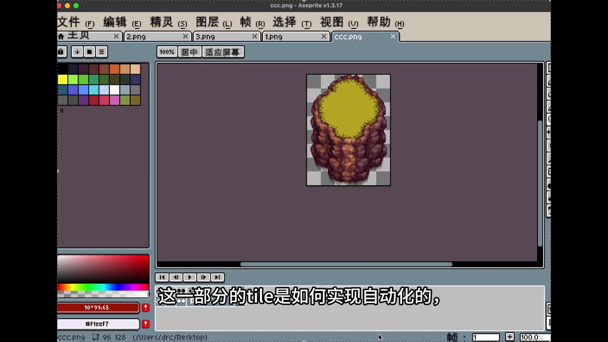
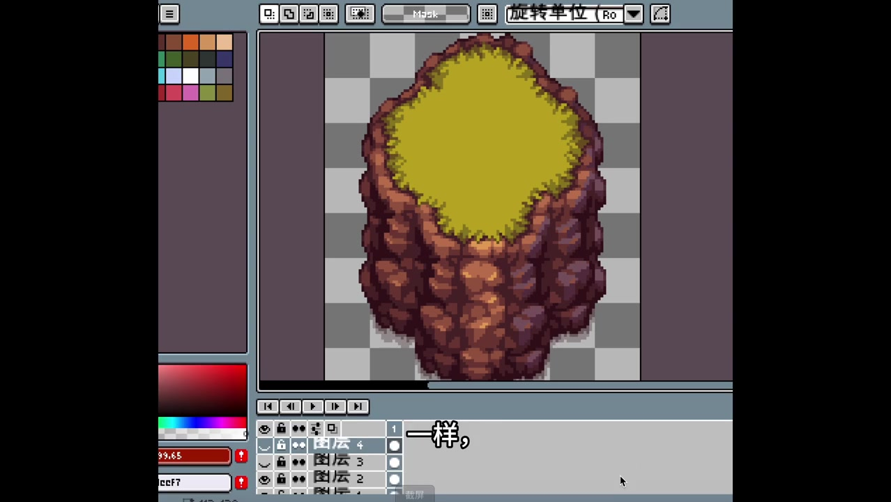
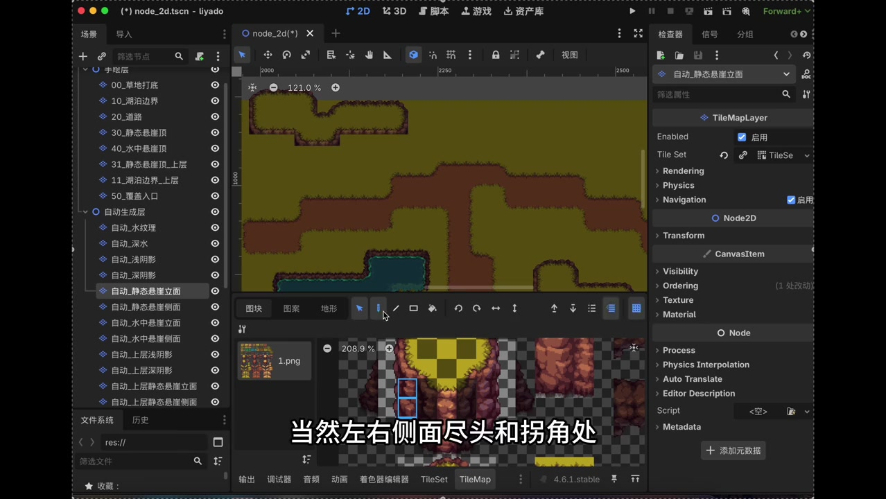
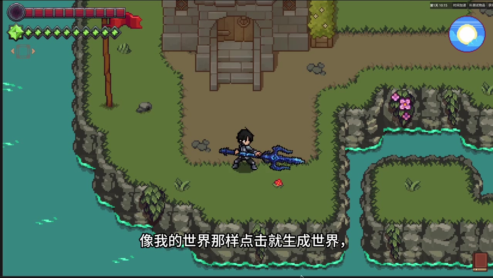
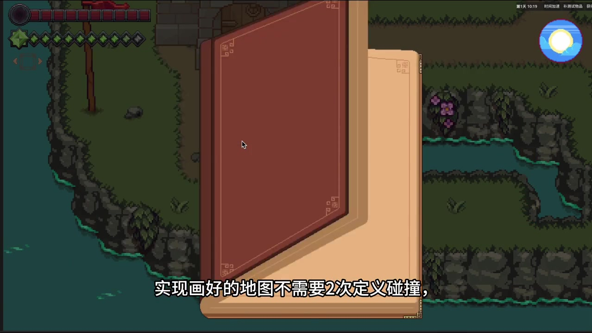

# xhs02_godot_tilemap

## 第 1 段

大家好呀,我是在开发独立游戏的DRC,今天我们继续来教学在勾大体引擎汇制Tile Map地图。上期视频我们讲了在引擎中建立基础的Tile Map,Lapolar而节点,并且建立了地形级,定义了基础的Tile 16。很多小伙伴私心问我,主帮你地图上那些山体Tile,怎么实现自动瓦片?好像不是Tile 16。今天我们就来详细讲解一下,这一部分的Tile是如何实现自动化的。首先我在模绘画软件展示一下这个素材,这就是我经常用的这个山体素材。用AI生成时,也用这个素材作为参考图,那么我们先拿一个普通Tile 16进行对比。这个就是草地和土路的过渡,由第一行左上角格,中上格和右上角,然后第二行左边格,中心填充格,以及右边格,然后是第三行左下角格,，中下格和右下角格子,然后是九公格的右边这两列,分别是左右,上内角和左右下内角以及左右对角组成。那么我们再看上山体的Tile,仔细观察其实可以看到很多地方是重复的。除了最明显的中间有很多内部橙色格,其实左上这些格子也是重复的。那么其实整个山体的顶面,其实也是一个Tile 16,为了更值观的表现。我直接把它拆开,重新组成了一个山体顶面Tile 16的版本,可以看到和之前的草地过渡到土的Tile 16。一样,那么我们再看这山体的另一部分,一般称之为山体里面,其实就是山体Tile 16中的左右下角,和下方的格子下面挂了三格,

---

## 第 2 段

去掉素材也是重复的部分,就变成三列三形的一个素材,也就是说我们,其实要正常定义,一,组山体顶面,Tile 16,，然后再挥句完在山体顶的左右下和下方的格子,下面挂上对应的三列里面就行了。当然左右侧面镜头和拐脚柱,还有侧里面要补上这里,我手动演示一下原理,挥句时可以看到,

---

## 第 3 段

其实中间正里面其实在同一行都是重复的,最后是侧面,需要补上侧里面,当然这个步骤不可能存靠手工,不然太费力了。我们可以在Node2D节点,下面建立一个手绘节点和自动生成层节点,手绘就是绘制勾带的基础的Tile 16地形级部分,可以用几型工具快速绘制,，自动层负责在绘制结束补起里面,编程方面完全可以由AI帮忙完成,只需要和AI描述好这个里面的组成,以及生成原理,就可以由AI帮我生成自动补里面的节点。甚至墙面装饰,和一些动画都可以用这个方法来自动填充。最终形态就是直接变为地形生成器,像我的世界那样点击就生成世界,那么这期视频就到这里。

---

## 第 4 段

下期视频我会讲,它有地图的碰撞,怎么自动画定义到瓦片级里。实现画好的地图,不需要两次定义碰撞。感兴趣的小伙伴,可以点个关注哦。

---

## 第 5 段

---

